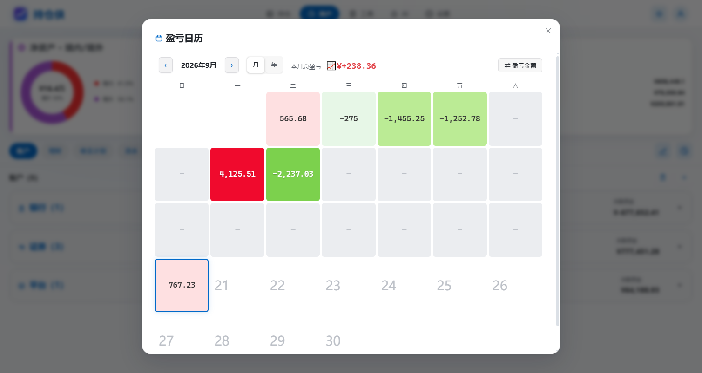
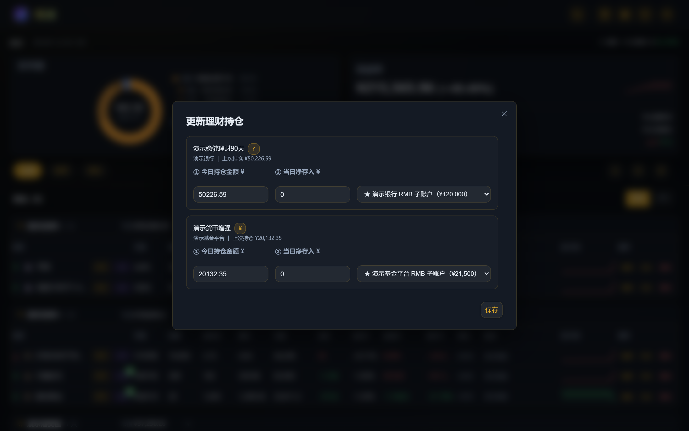
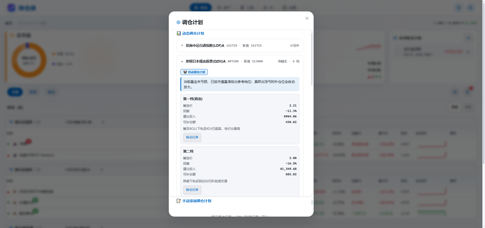
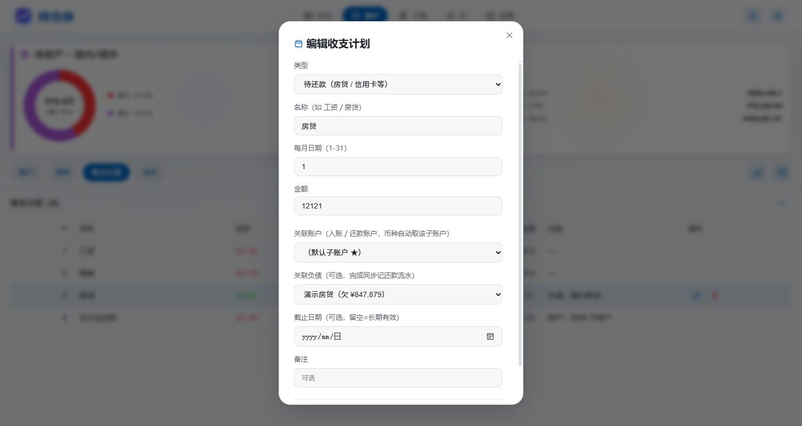
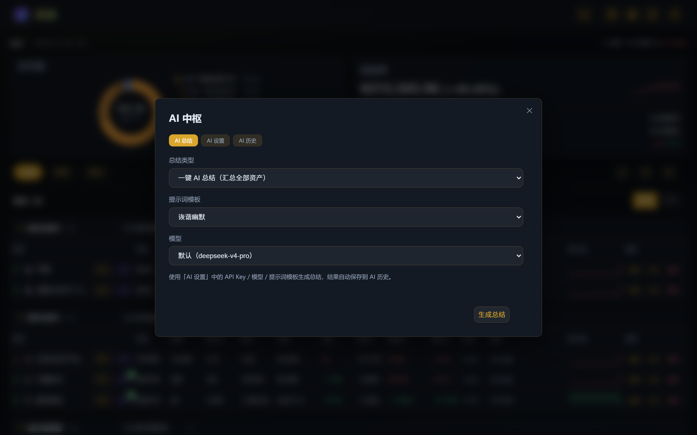

# Portfolio · 持仓侠 / My Folio Hub

> **中文**：自托管的多用户个人投资持仓看板，统一管理 **A 股 / 美股 / 港股 / 基金** 持仓与**理财 / 现金 / 负债 / 消费**全景资产。自动刷新行情、计算盈亏、记录历史，提供盈亏日历、技术分析、动态调仓计划与 AI 总结。桌面与移动端自适应。**极致轻量：前后端单二进制、纯 Go 无 CGO，镜像仅约 28 MB，实测常驻内存 10~16 MB。**
>
> **English**: A self-hosted, multi-user personal investment dashboard for tracking **A-share / US / HK stocks and funds**, plus wealth products, cash, liabilities and consumption. Auto-refreshes quotes, computes P/L, records history, and offers a P/L calendar, technical analysis, dynamic rebuy plans, and AI summaries. Responsive on desktop and mobile. **Ultra-lightweight: a single pure-Go binary (no CGO); ~28 MB image and only 10–16 MB resident memory.**

## 🌐 在线 Demo / Live Demo

**<https://www.mrchenyifei.icu:19999>** · 预置了一套模拟数据（8 只持仓 / 多币种账户 / 理财 / 负债 / 近 30 日盈亏历史），行情定时自动刷新。
A pre-seeded demo instance with mock data is live at the link above; quotes refresh automatically.

## ✨ 功能一览

**持仓与行情**
- 持仓增删改查，按资产来源（券商 / 平台）分组；股票（A 股 / 美股 / 港股）与基金（场内 / 场外 / QDII）统一管理
- 一键刷新全部行情（腾讯行情 / 新浪外汇 / 公开基金 API），当日 / 总盈亏、盈亏率、持有天数、近 20 日迷你走势
- 表格 / 卡片双视图，分组可折叠，展开行悬停切换 当日 / 总盈亏
- 加减仓流水、分红记录、操作指南（买卖笔记）

**盈亏分析**
- 盈亏日历：按日着色的月度热力、本月总盈亏、年 / 月快速跳转、单日持仓级明细（前一天 / 后一天切换）

**技术分析**
- K 线 + MA / MACD / RSI / KDJ / BOLL 全指标
- 自动信号评级（看多 / 看空）+ 逐日信号回测胜率与期望收益，结果缓存
- 🌟 **基金可关联场内 ETF 做技术分析**：场外基金 / QDII 本身没有 K 线，填一个「关联股票代码」指向对应的场内 ETF（如中概互联 → `513050`），即可像股票一样看 K 线、指标、信号评级与回测；关联代码同时驱动动态补仓档位的计算

**资产**
- 来源 / 理财 / 负债 / 现金 / 消费五类资产，环形占比 + 明细钻取
- 理财：批量「更新理财持仓」、申购 / 赎回流水、上次快照对比
- 现金账户：多币种（RMB / HKD / USD）、每来源每币种默认子账户（★）、账户间转账、现金流水
- **流水**：现金流水与负债流水统一汇总，可按年份 / 起止日期筛选；支持行内**修改 / 删除**（同步冲正账户与负债余额），MCP 写入的流水带高亮 **MCP** 来源标签
- 负债：利率支持 0，编辑 / 历史完整可溯

**调仓计划**
- 动态补仓档位：净值刷新时自动为持仓基金 / 亏损股票计算（含已执行标记），首页按钮显示触发数量徽标
- **一键落库执行**：点「标记已补 / 已减」选资金子账户并填实际成交金额与份额，自动更新持仓份额 / 成本、联动子账户余额并记流水
- 手动添加操作记录，人工计划与自动档位同屏管理

**MCP 服务**
- 内建零依赖 MCP 服务端（stdio / HTTP(SSE)），hermes 等 AI 客户端可按「备注（mcp 标记）」查询账本并记录流水
- 提供 `list_accounts` / `list_cash_accounts` / `list_holdings` / `list_wealth` / `list_markers` 查询工具与 `record_transaction` 写入工具，MCP 写入的流水在表格中打 **MCP** 标签

**AI 总结**
- 一键 AI 总结（全资产 / 权益类），自定义提示词模板，支持多个模型配置（OpenAI 兼容接口）
- 每日收盘后自动生成（复用 21:00 快照），可随净值推送发送
- 历史记录一键回看；结果与历史均按 **Markdown 渲染（支持表格）**，XSS 安全转义

**其他**
- 通知渠道：钉钉（加签）、邮件（隐式 TLS / STARTTLS），按策略推送
- 小工具：权益盈亏录入、美元盈亏、汇率计算、贷款计算器
- 多用户隔离（`X-User-Id`），支持数据清空、删除（需输入确认短语）
- 暗黑 / 亮色双主题 + 主题色自定义：内置 3 套预设（土豪金 / 豆沙绿 / 经典蓝），取色器自定义任意主题色（本机 `localStorage` 记忆）

## 🆕 近期新增

- **🔌 MCP 服务（AI 客户端接入）**：内建零依赖的 MCP（Model Context Protocol）服务端，hermes 等 AI 客户端可按实体的「备注（mcp 标记）」**查询账本并记录流水**（持仓加仓 / 减仓 / 分红、现金存入 / 取出、理财申购 / 赎回）；支持 stdio 与 HTTP(SSE) 两种传输，界面内即可开关、配置与一键复制客户端配置。MCP 写入的流水会记录来源，在「流水」表格带高亮 **MCP** 标签。详见下文「MCP 服务」与 [`docs/mcp-api.md`](docs/mcp-api.md)。
- **补仓计划真实落库**：调仓计划的「标记已补 / 已减」改为弹框确认——选择资金子账户、填写**实际成交金额与份额**，确认后同步**更新持仓份额与摊薄成本**、扣减 / 入账子账户余额并记一笔现金流水（该流水可在「资产 → 流水」中修改 / 删除）。
- **流水可修改 / 删除**：资产全景「流水」表格新增操作列，支持修改（现金流水可改子账户、方向、金额、备注；负债流水可改类型、金额、备注）与删除，改动会同步冲正账户 / 负债余额。
- **收支计划**：首页紧凑卡片 + 「收支计划」页统一管理每月**待入账 / 待还款**；勾选完成即把真实出入账记入对应现金账户（关联负债则同步记一笔还款流水，可一键撤销）；已完成项自动从首页卡片隐藏（不再置灰），条目过多时卡片限高、内部滚动查看。
- **待还款提前提醒**：到期前一天按自定义时间（默认 07:00）通过钉钉 / 邮件推送。
- **完整迁移（导出 / 导入）**：勾选「完整迁移」后，除五大类资产外还会一并导出 / 导入 **收支计划、来源账户元数据（类型 / 境内外 / 币种）、AI 配置、应用设置与净值历史**，跨实例无缝搬迁。
- **资产再平衡**：按风险画像（稳健 / 激进，可自定义）对比当前持仓，给出各类资产目标占比与买入 / 卖出调整建议。
- **理财快照审计与撤销**：误改 / 误删的每日快照可查看改动前后并一键撤销。

## 界面预览

| 主页（亮色） | 资产 |
| :---: | :---: |
|  |  |

| 盈亏日历 | 技术分析（QQQ） |
| :---: | :---: |
|  |  |

| 更新理财持仓 | 动态调仓计划 |
| :---: | :---: |
|  |  |

| 编辑收支计划 | AI 中枢 · AI 总结 |
| :---: | :---: |
|  |  |

## 功能详解

### 持仓管理

主页按资产来源分组展示全部持仓，每组卡片显示市值、当日盈亏与累计盈亏。表格视图列：名称 / 代码 / 份额 / 成本价 / 现价 / 市值 / 当日 / 当日% / 总盈亏 / 盈亏% / 持仓天数 / 近 20 日走势 / 操作（备注列默认隐藏，代码保留，随时可恢复）。每只持仓支持 编辑、历史盈亏（每日表格 + 曲线）、分析、修改（加减仓 / 分红）与删除。

表格行内的「操作」列统一为**纯图标按钮**（编辑 / 历史 / 删除），默认随鼠标悬停淡入，触屏设备常显；图表列、金额列均按等宽数字对齐。

### 盈亏日历

「盈亏分析」弹框为纯日历视图（已移除旧版「盈亏走势」Tab）：按日着色显示每日总盈亏（红涨绿跌），悬停有数据的日期会以表情符号（😍 大涨 → 😱 大跌）代替金额展示当日情绪；点击月份标题可年 / 月快速跳转；点击有数据的日期弹出当日持仓级盈亏明细，可用 ‹ › 按钮在前 / 后一个有数据日期间连续浏览。

### 技术分析

每只持仓点「分析」弹出技术分析：K 线叠加 MA / BOLL，副图 MACD / RSI / KDJ，并给出自动信号评级（看多 / 看空）、逐日信号回测的胜率与期望收益，辅助判断趋势与反弹。

#### 基金如何接入技术分析（关联场内 ETF）

场外基金与 QDII 只有每日净值，没有可用的 K 线，且净值 T+1 才更新 —— 直接拿净值算均线、MACD 意义不大。因此编辑基金持仓时提供了「关联股票代码」一栏：

| 填写情况 | 效果 |
|---|---|
| 填对应的场内 ETF 代码（如 `513050`） | 该基金沿用这只 ETF 的 K 线，MA / MACD / RSI / KDJ / BOLL 与信号回测全部可用，分析入口照常显示 |
| 留空 | 视为不可分析，「分析」按钮不出现 —— 避免用净值算出一套误导性的信号 |

关联代码同时驱动**动态补仓档位**：档位依据关联 ETF 的均线与波动率给出，而不是基金净值，所以场外基金也能拿到与场内一致的价量依据。若关联代码的 K 线拉取失败，该基金的补仓档位会退回为空，不会拿陈旧行情给出建议。

### 资产 · 理财与现金

资产页覆盖来源 / 理财 / 负债 / 现金 / 消费五类，环形图显示占比，点击可钻取明细。

「更新理财持仓」弹框一次性录入所有理财产品的当日持仓金额与当日净存入（转入为正、取出为负），并可指定联动资金账户（申购扣款 / 赎回回款自动记账），保存后自动生成快照与收益统计。

现金账户支持多币种（RMB / HKD / USD），每个来源的每个币种各有一个 ★ 默认子账户；支持账户间转账（同币种）与完整的现金流水查询。

### 动态调仓计划（补仓计划）

「调仓计划」弹框分两部分：

- **📊 动态调仓计划**：净值刷新时（定时 21:00 / 手动刷新）自动为持仓基金与亏损股票计算补仓档位，保存在 `holdings.buy_plan`（不写入备注列）。档位触发后首页按钮显示红底数量徽标，执行后可标记「已执行」。
- **📝 手动添加调仓计划**：手动记录自己的买卖计划与操作笔记。

### AI 总结

「AI 中枢」三个 Tab：

- **AI 总结**：选择总结类型（一键全资产 / 权益类）、提示词模板与模型后生成；结果自动保存到历史
- **AI 设置**：多个模型配置（OpenAI 兼容，如 DeepSeek），API Key、地址、提示词模板均可自定义；可开启每日收盘后自动生成并随净值推送发送
- **AI 历史**：最近总结列表，点击回看全文

总结结果与历史预览均按 **Markdown 渲染**（标题 / 列表 / **表格** / 代码块 / 引用 / 链接），渲染前做 HTML 转义，模型输出不会被注入执行。

### 通知推送

支持钉钉（加签机器人）与邮件（隐式 TLS / STARTTLS），推送内容为当日总盈亏 + 逐只持仓明细。推送策略见下方[通知策略](#通知策略)。

### 小工具

「资产工具」内含：权益盈亏录入、美元盈亏录入、汇率计算、贷款计算器。

### 多用户与数据隔离

- 前端以浏览器 `localStorage` 记住当前用户，请求携带 `X-User-Id`，后端按用户过滤全部数据
- 用户数上限 5；每类资产（持仓 / 来源 / 理财 / 负债 / 消费 / 现金）每用户上限 200 条
- 危险操作（清空 / 删除）需输入确认短语解锁

### 主题与外观

暗黑 / 亮色双主题一键切换；主题色内置土豪金 / 豆沙绿 / 经典蓝三套预设，也可用取色器自定义任意颜色（本机 `localStorage` 记忆）。所有图标使用 `currentColor`，跟随主题色变化。

## 技术栈

| 层 | 选型 |
|---|---|
| 后端 | Go 1.25 + Gin + SQLite（`modernc.org/sqlite`，**纯 Go 无 CGO**） |
| 前端 | 原生 HTML / CSS / JS，经 esbuild 构建到 `web/dist` 后由 `//go:embed web/dist` 内嵌二进制，无需单独部署静态文件 |
| 行情 | 腾讯 `qt.gtimg.cn`、新浪外汇、公开基金 API |
| AI 客户端 | 内建 MCP 服务端（`portfolio mcp`，stdio / HTTP(SSE)，默认端口 `9988`） |
| 部署 | Docker / Docker Compose（主端口 `9989`） |

### 实测资源占用

在 x86_64 主机 + Docker 27.3.1 上对**线上运行实例**实测（`docker stats` / cgroup v2 统计，前端已 gzip 压缩）：

| 指标 | 实测值 |
|---|---|
| 镜像体积 | **28.3 MiB**（Alpine 基础镜像 + 静态二进制 20.0 MiB，无任何运行时依赖） |
| 常驻内存 | 空闲 **9.7 MiB** → 跑过流量后稳态 **15.5 MiB**，峰值 **16.7 MiB**（另开的 demo 实例 8.8 MiB） |
| CPU | 空闲 **0.00%**（45 s 内仅消耗 9 µs CPU）；连续 **300 次** `/api/home` 聚合请求累计 **1.02 s** CPU，≈ **3.4 ms / 次** |
| 网络 | 300 次 `/api/home` 合计出站 3.76 MB（未压缩 ≈ 12.5 KB/次，开启 gzip 后更小） |
| 容器磁盘 | 容器可写层 **0 B**（全部状态落在数据卷）；真实实例 `data/` = **51.6 MB**（含 30.7 MB SQLite 活库 + 5 份历史备份） |
| 容器进程数 | 5 |

> 结论：单实例常驻内存约十几 MB、CPU 在无请求时基本为 0，即使放在 NUC / 软路由级别的小主机上也能长期零负担运行。

## 🔌 MCP 服务（连接 hermes 等 AI 客户端）

本项目内建了一个**零依赖的 MCP（Model Context Protocol）服务端**，可让 hermes 等支持 MCP 的 AI 客户端通过标准协议连接本应用：**先查询**账本结构（账户 / 子账户 / 持仓 / 理财），再**基于实体的「备注」作为 mcp 标记记录流水**（持仓加仓 / 减仓 / 分红、现金存入 / 取出、理财申购 / 赎回）。实现参考了 mayswind/ezbookkeeping 的 `pkg/mcp`（以 JSON-RPC 暴露 `tools/list` 与 `tools/call`）。完整的工具参数、返回结构与调用示例见 [`docs/mcp-api.md`](docs/mcp-api.md)。

### 在界面里配置

进入 **AI 中枢 → AI 设置 → MCP 参数** 子页：可一键开启/关闭 MCP、选择传输方式（HTTP / stdio）、填写监听地址与鉴权令牌等必填项，并**一键复制 hermes 客户端配置（或导出的服务端 `mcp.json`）**；同页可查看 MCP 运行状态（进程 / 监听地址 / 最近请求）。保存后 HTTP 模式需重启 Web 服务生效，stdio 模式用 `portfolio mcp` 启动。

### 两种启动方式

1. **stdio（本地，推荐给 hermes 拉起子进程）**
   ```bash
   portfolio mcp                       # 默认 HTTP 之外的 stdio 传输
   portfolio mcp --transport stdio --user 1
   # hermes 配置（见 hermes-mcp-stdio.example.json）：
   # { "mcpServers": { "portfolio": { "command": "/绝对路径/portfolio", "args": ["mcp"] } } }
   ```
2. **HTTP(SSE)（远程连接）**：在主程序 `mcp.json` 中启用后随 Web 服务一起拉起
   ```bash
   # mcp.json（仓库根，或用环境变量 MCP_ENABLED/MCP_TRANSPORT/MCP_HTTP_ADDR/MCP_TOKEN/MCP_USER_ID 覆盖）
   # { "enabled": true, "transport": "http", "http_addr": ":9988", "token": "", "user_id": 0 }
   # hermes 配置（见 hermes-mcp-config.example.json）：
   # { "mcpServers": { "portfolio": { "url": "http://127.0.0.1:9988/mcp" } } }
   ```
   端点：`GET /mcp`（SSE 握手）、`POST /mcp/messages?sessionId=`（发消息）、`POST /mcp/rpc`（非 SSE 调试，直接返回 JSON）。

### 给实体打「mcp 标记」

在**新增/编辑子账户、持仓、理财**的弹框中，备注输入框的提示已改为「用于mcp的标记」。把备注填成你约定的标记（如 `hermes-券商A`），AI 即可通过该标记定位目标。

### 已提供工具

**写入**
- `record_transaction`：按 `marker` 定位实体并记录一笔流水
  - `holding`（持仓）：`action=buy/sell/dividend`（加仓 / 减仓 / 分红，买入扣款、卖出与分红入账自动落到该持仓来源同币种的默认子账户）
  - `cash`（子账户）：`action=deposit/withdraw`（存入 / 取出）
  - `wealth`（理财）：`action=subscribe/redeem`（申购 / 赎回）
  - 例：`record_transaction(marker="hermes-券商A", action="buy", quantity=100, price=12.5, fee=0)`

**查询（只读）**
- `list_markers`：列出当前用户所有带 mcp 标记的实体（持仓 / 子账户 / 理财），便于 AI 选择 `marker`
- `list_accounts`：账户来源（平台 / 银行 / 券商等），默认内联其下现金子账户；支持 `source_id`、`include_cash`
- `list_cash_accounts`：现金子账户扁平列表（所属来源、币种、类型、余额、★默认、mcp 标记），支持 `source_id`、`currency` 过滤，并给出各币种合计
- `list_holdings`：持仓列表（份额 / 成本价 / 现价 / 市值 / 浮动盈亏 / 盈亏% / 资产类型 / 买入日期 / mcp 标记），默认过滤已清仓，支持 `source_id`、`symbol`、`category`、`include_closed`
- `list_wealth`：理财产品列表（最新持仓金额、快照日期、累计收益、mcp 标记），支持 `source_id`

所有工具都可用 `username` 或 `user_id` 指定归属用户，省略则使用默认（首个）用户。

### 流水来源标记

MCP 写入的流水会**记录来源**：`cash_flow.source = 'mcp'`，且流水 `type` 以 `mcp_` 开头（如 `mcp_buy` / `mcp_deposit`），备注保留 `MCP·<action>·<note>` 前缀。资产全景「流水」表格对这类记录显示高亮的 **MCP** 标签，与手动 / 应用内操作一眼区分；升级前已存在的 MCP 流水会在启动时自动回填来源标记。

## 快速开始

### 云端镜像（推荐，无需克隆源码）

镜像由 GitHub Actions 自动构建（`linux/amd64` + `linux/arm64`），推送到 GHCR，每个 main 提交更新 `latest`、每个 `v*` 标签发布版本号：

```bash
docker run -d --name portfolio -p 9989:9989 -p 9988:9988 \
  -v portfolio-data:/data \
  -e TZ=Asia/Shanghai \
  -e MCP_ENABLED=true \
  -e MCP_TRANSPORT=http \
  -e MCP_HTTP_ADDR=:9988 \
  ghcr.io/w1570187062/my-portfolio-hub:latest

# 或用 docker compose（compose.yml 里 image 填 ghcr.io/w1570187062/my-portfolio-hub:latest）
docker compose up -d
```

- `-p 9989:9989`：Web 主端口（前端页面与 API）。
- `-p 9988:9988`：MCP 服务端口（HTTP/SSE 传输，供 hermes 等 AI 客户端远程连接）；若不需要 AI 客户端接入可省略该映射，并将 `MCP_ENABLED` 留空（默认关闭）。
- `MCP_ENABLED=true` / `MCP_TRANSPORT=http` / `MCP_HTTP_ADDR=:9988`：开启并配置内建 MCP 服务端（详见下文「MCP 服务」）。

访问 <http://localhost:9989> 即可；升级只需 `docker pull` 后重建容器。

### 从源码构建

```bash
docker compose up -d --build
# 或强制无缓存重建
docker compose build --no-cache && docker compose up -d --force-recreate
```

数据持久化在 `data/portfolio.db`，挂载为 volume。

### 本地运行

```bash
go mod tidy
go build -o portfolio .      # 产物 ./portfolio
./portfolio                  # 监听 :9989，可用 PORT 环境变量覆盖
# 开发期也可直接：go run .
```

数据落在 `./data/portfolio.db`（compose 已挂 volume）。停止：`docker compose down`（保留数据）；`docker compose down -v` 连数据卷一并删除，慎用。

## 定时任务

| 时间（北京时间） | 任务 |
|---|---|
| **07:00** | 美股收盘后（T+1）定时快照 |
| **15:15** | A 股收盘后定时快照 |
| **21:00** | 基金净值公布后定时快照 |
| **00:00** | 上一交易日盈亏落库、归零 `prev_close`，使新一天当日盈亏从 0 起算 |
| **21:30** | 若开启 AI「自动总结」，生成收盘总结并（可选）推送通知 |

均跳过周末与中国法定节假日（`cnHolidays`）。

## 通知策略

| 策略 | 触发 |
|---|---|
| 每次更新（默认） | 任何手动 / 自动刷新都推送 |
| 仅收盘后 | 仅定时快照推送 |
| 仅补仓信号 | 仅在有补仓档位触发时推送 |

## 许可

自托管个人项目。请遵守所在司法辖区的金融数据法规。
