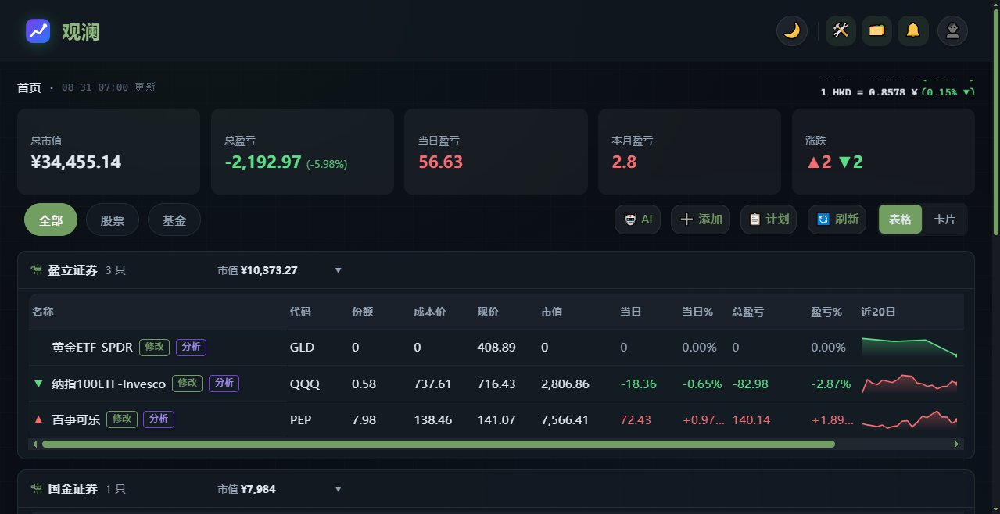

# Portfolio · 观澜

> 自托管的多用户个人投资持仓看板，统一管理 **A 股 / 美股 / 港股 / 基金** 持仓。自动刷新行情、计算盈亏、记录历史，并提供盈亏日历、走势、资产全景、AI 总结与技术分析。桌面与移动端自适应。



## 功能一览

- 持仓增删改查、一键刷新行情、当日 / 总盈亏、持有天数
- 卡片 / 表格双视图；盈亏日历、盈亏走势（SVG）
- 资产全景（来源 / 理财 / 负债 / 现金 / 消费）、动态补仓计划
- 技术分析：K 线 + MA / MACD / RSI / KDJ / BOLL + 逐日信号回测胜率
- 小工具：补仓计算器、权益 / 美元资产盈亏录入
- AI 总结（全资产 / 权益类），支持 **goja 引擎** 自定义评级脚本（编写 / 测试 / 热加载）
- 通知渠道：钉钉（加签）、邮件（隐式 TLS / STARTTLS），按策略推送
- 多用户隔离（`X-User-Id` 请求头），支持数据隔离、清空、删除
- **暗黑 / 亮色双主题**；UI 主色豆沙护眼绿 `#6f9e5e`；**涨红跌绿**（国内惯例）

## 界面预览

| 主页（亮色） | 资产全景 |
| :---: | :---: |
|  |  |

| 技术分析（QQQ） |
| :---: |
|  |

> 截图由 browser-skill 在真实浏览器自动化截取。需要干净无遮挡的图时，用 `bsk screenshot --ref @eN` 裁剪到目标元素（如资产全景数据表格），即可避开 Agent 控制浮条与光晕。

## 技术栈

| 层 | 选型 |
|---|---|
| 后端 | Go 1.25 + Gin + SQLite（`modernc.org/sqlite`，**纯 Go 无 CGO**） |
| 前端 | 原生 HTML / CSS / JS，通过 `//go:embed web` 内嵌二进制，构建后无需单独部署静态文件 |
| 行情 | 腾讯 `qt.gtimg.cn`、新浪外汇、公开基金 API |
| 自定义脚本 | [goja](https://github.com/dop251/goja)（内嵌 ECMAScript 引擎） |
| 部署 | Docker / Docker Compose（默认端口 `9989`） |

## 快速开始

### Docker（推荐）

```bash
docker compose up -d --build
# 或强制无缓存重建（前端改动必须）
docker compose build --no-cache && docker compose up -d --force-recreate
```

数据持久化在 `data/portfolio.db`，挂载为 volume。

### 本地运行

```bash
go run .      # 监听 :9989，可用 PORT 环境变量覆盖
```

### 远程部署（自托管）

本地构建与部署流程（含版本号、验证清单、常见坑）见 [DEPLOY.md](./DEPLOY.md)。

## 目录结构

```
portfolio/
├── main.go                # 入口：embed web、初始化 DB / FX / 定时任务
├── internal/
│   ├── api/               # Gin 路由 + HTTP 处理（handler / analysis / asset / ai / notify / import）
│   ├── db/                # SQLite 访问、表结构、迁移
│   └── market/            # 行情抓取、技术指标、概率评估、补仓计划、goja 引擎
├── web/                   # 前端（//go:embed 打包）
│   ├── index.html / app.js / style.css / favicon.svg
├── Dockerfile / docker-compose.yml
├── update-version.sh      # 写 VERSION = git short-hash|时间戳（破除浏览器缓存）
├── DEPLOY.md              # 远程部署流程
└── docs/screenshots/      # README 配图
```

## 数据模型（核心表）

| 表 | 作用 |
|---|---|
| `holdings` | 持仓主表（按 `user_id` 隔离） |
| `price_daily` / `pnl_daily` | 每日收盘价 / 每日盈亏汇总（按用户） |
| `position_tx` / `buy_plan_executed` | 加减仓流水 / 补仓档位已执行标记 |
| `asset_sources` / `wealth_products` / `wealth_snapshots` | 资产来源 / 理财 / 理财每日快照 |
| `liabilities` / `consumptions` / `cash_accounts` | 负债 / 消费 / 现金 |
| `operation_guides` | 持仓买卖笔记（操作指南） |
| `users` | 多用户（按 `X-User-Id` 隔离数据） |
| `analysis_cache` / `analysis_script` | 技术分析缓存 / 全局自定义评级脚本 |
| `fx_cache` / `meta` / `notify_settings` / `ai_settings` / `ai_summary_history` | 汇率缓存 / KV / 通知 / AI 配置 / 总结历史 |

> `buy_plan` 字段（`holdings` 上）保存净值刷新时计算的动态补仓档位 JSON，操作指南弹框直接展示，不写入 `note`。

## 定时任务

| 时间（北京时间） | 任务 |
|---|---|
| **07:00** | 美股收盘后（T+1）定时快照 |
| **15:15** | A 股收盘后定时快照 |
| **21:00** | 基金净值公布后定时快照 |
| **00:00** | 上一交易日盈亏落库、归零 `prev_close`，使新一天当日盈亏从 0 起算 |
| **21:30** | 若开启 AI「自动总结」，生成收盘总结并（可选）推送通知 |

均跳过周末与中国法定节假日（`cnHolidays`）。

## 通知策略

| 策略 | 触发 |
|---|---|
| 每次更新（默认） | 任何手动 / 自动刷新都推送 |
| 仅收盘后 | 仅定时快照推送 |
| 仅补仓信号 | 仅在有补仓档位触发时推送 |

## 涨红跌绿

遵循国内惯例：**上涨红、下跌绿**。`--up:#f87171`、`--down:#4ade80`（暗色）；亮色主题同步切换为更深的 `#dc2626` / `#16a34a` 以保证对比度。

## 许可

自托管个人项目。请遵守所在司法辖区的金融数据法规。